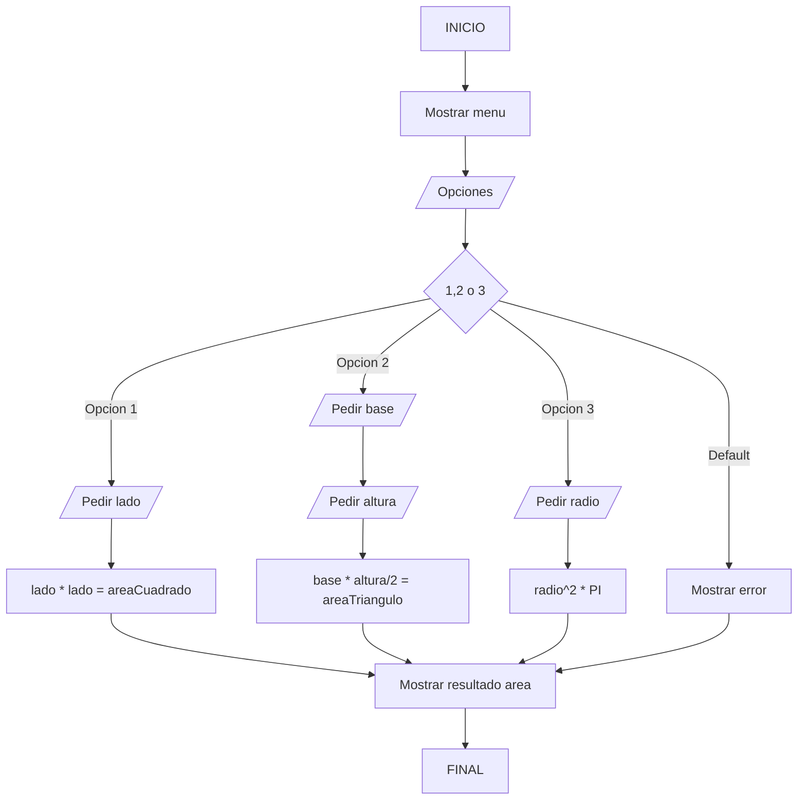

```mermaid
graph TD;

INICIO-->id1[Mostrar menu]
id1-->id2[/Opciones/]
id2-->sw{1,2 o 3}
sw-->|Opcion 1|1[/Pedir lado/]
sw-->|Opcion 2|2[/Pedir base/]
sw-->|Opcion 3|3[/Pedir radio/]
sw-->|Default|4[Mostrar error]
2-->2.1[/Pedir altura/]
1-->1.1[lado * lado = areaCuadrado]
2.1-->2.2[base * altura/2 = areaTriangulo]
3-->3.1[radio^2 * PI]
1.1-->mostrar[Mostrar resultado area]
2.2-->mostrar
3.1-->mostrar
4-->mostrar
mostrar-->FINAL
```